# quickstart

## 准备工作
1. Unity3D (版本不限，但目前仅测试过2018.2)
2. 微信开发者工具开发版（注意一定得是开发版。）
[传送门](https://developers.weixin.qq.com/miniprogram/dev/devtools/nightly.html)

## unity侧环境搭建
使用Unity3D打开本项目的`UnityProject`目录后，看到目录结构如下（该图截于本项目首次落成，后续可能有变）

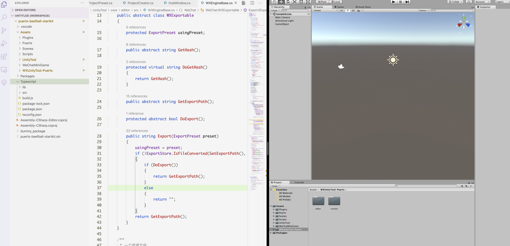

1. Assets/Plugins 是unity标准目录，不详述
2. Assets/Puerts 是puerts的unity代码
3. Assets/Scenes 是示例场景存放位置
4. Assets/Scripts 是示例MonoBehaviour存放位置
5. Assets/UnityTool和Assets/WeChatMiniGame 是微信引擎提供的资源转换工具
6. Assets/WXUnityTool-Puerts 是基于微信引擎的转换工具扩展的有关Puerts和adaptor的内容
7. Typescript/src 是业务逻辑代码存放位置
8. Typescript/lib 是unity侧编写TS代码时使用的相关支持框架

首先你需要使用puerts提供的代码生成能力生成c#桥接代码和给Typescript使用的d.ts，位于Assets/Gen目录

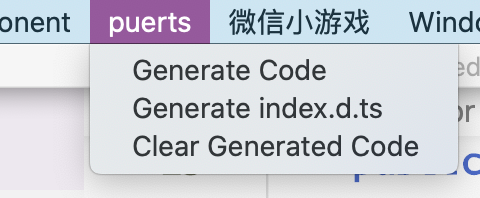

然后在Typescript目录执行npm run build，将TS代码编译成JS。（首次执行前，需要在该目录执行npm install安装node依赖包）

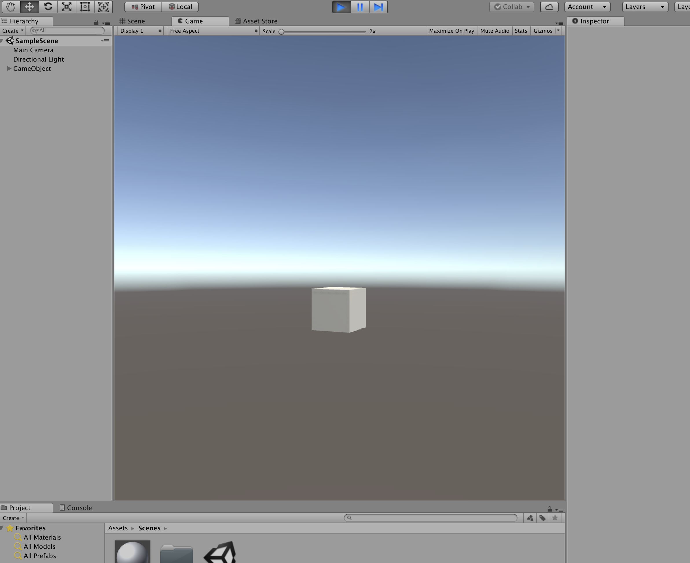

此时点击预览SampleScene，可以看到Unity侧的demo能正常执行了。

## 导出至微信引擎
点击微信小游戏菜单里的导出。

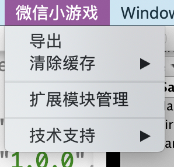

在弹出的面板里选择创建小游戏项目模板，然后选择你要创建项目的路径。

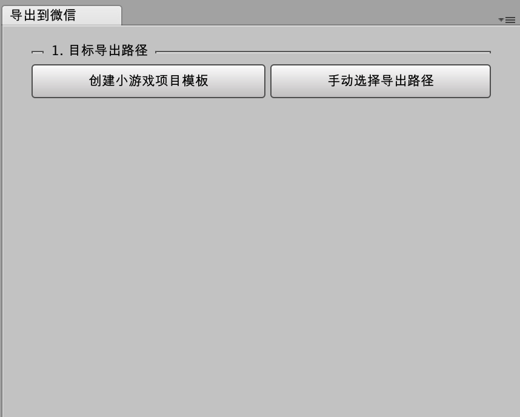

选择好后，依次使用“导出PuerTS项目代码”、“导出当前场景”（先在Unity里激活SampleScene）导出资源包。

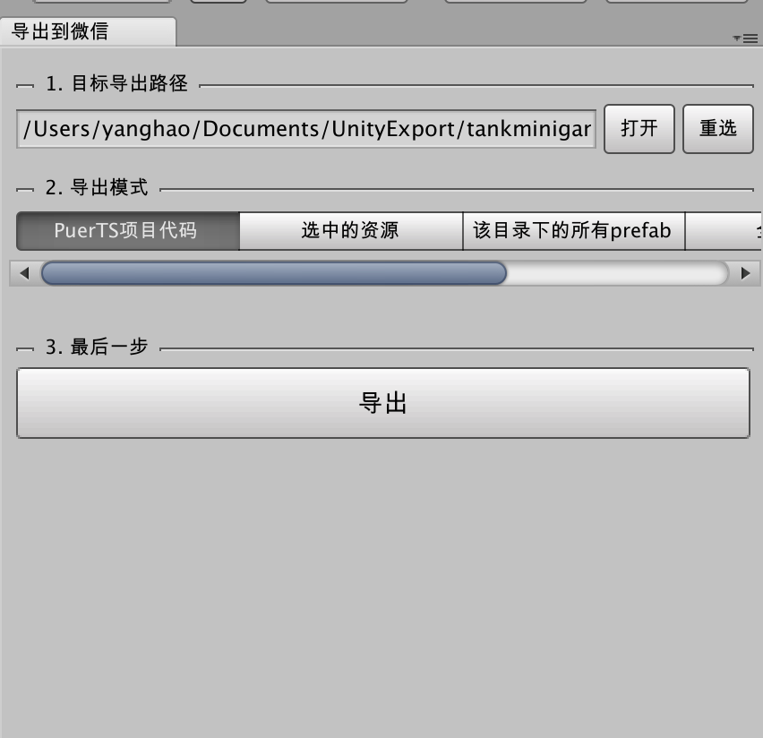

如有必要，选择Project里需要导出的资源，并使用“选中的资源”导出。（如本例中，SampleScene会异步加载Scenes/resources/Cube.prefab）

## 在微信引擎侧调试
打开微信开发者工具，在小游戏tab选择“导入”，然后选择您刚刚在unity里创建的项目。

在右侧详情处需要先将es6转es5打开。

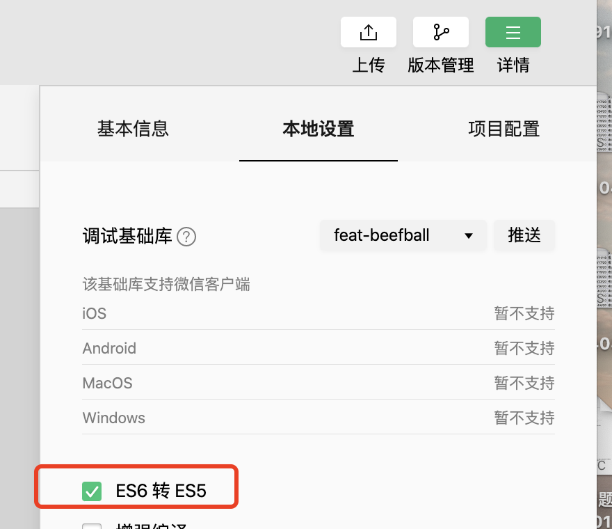

点击“方案工具”

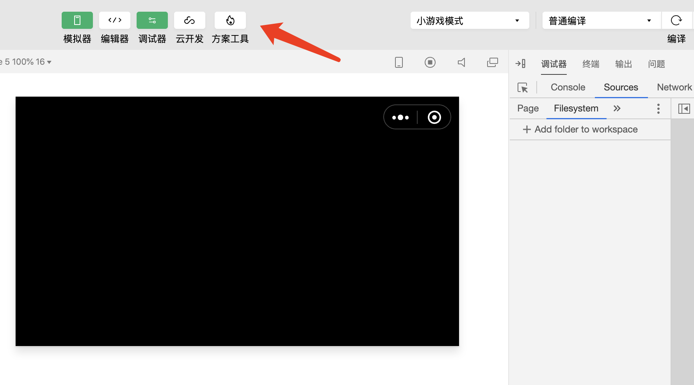

在资源管理器里找到我们刚刚导出的三个包（.mgepackage）依次双击导入

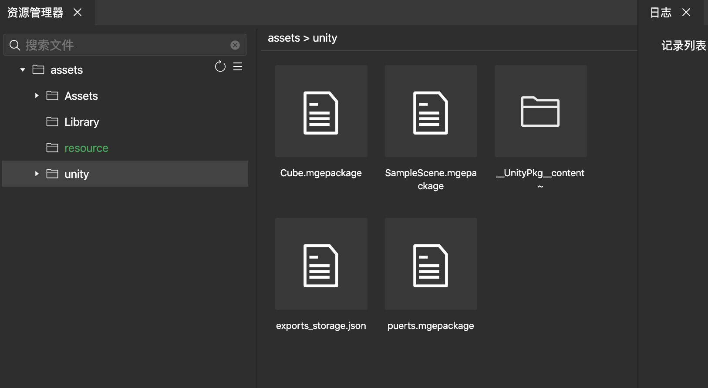

可以看到目录里出现了对应unity里的SampleScene.scene，双击预览

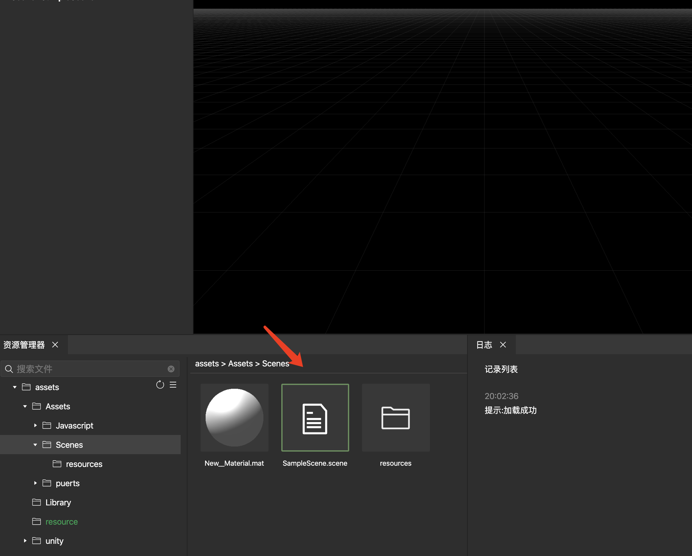

点击顶部的播放，即可看到我们在unity里做的demo在微信侧成功还原。

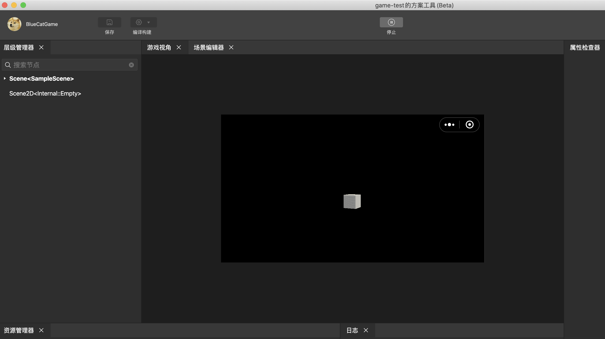

